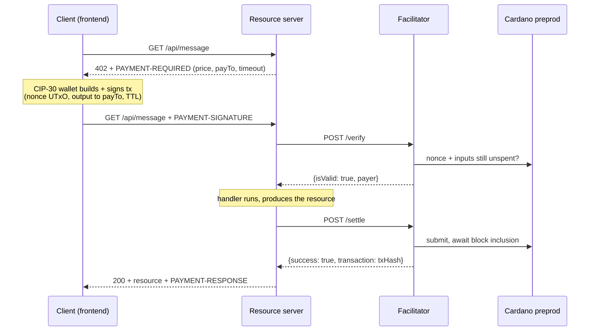

# x402 on Cardano — a payment-per-request demo

An end-to-end demo of the [x402 payment protocol](https://github.com/coinbase/x402) (`exact` scheme, v2) settling real ADA on **Cardano preprod**. A browser client, a resource server, and a facilitator walk one HTTP request through the full 402 → pay → retry loop, showing every protocol artifact on screen as it happens.

All three x402 roles run locally: the browser **client**, the resource **server**, and a deliberately minimal **facilitator**.

## The facilitator

The resource server can't validate a Cardano transaction itself, so it delegates to a facilitator: `/verify` (does this signed tx really pay the seller, un-replayed?) and `/settle` (submit it, wait for a block).

`facilitator/` is the smallest spec-compatible implementation — **~130 lines, no protocol logic of its own**. `@x402/cardano` already ships the reference facilitator-role scheme (all seven verification rules, the nonce/replay guard, the duplicate-settlement cache, the masumi checks); this is just the HTTP surface the spec defines wired to it. Compatibility comes from reusing the reference implementation rather than re-deriving it.

It **holds no funds and signs nothing** — the client's wallet pays the fee and signs everything, so the facilitator needs only a Blockfrost project id to read chain state and broadcast (no mnemonic, no keys).

**Swapping it out** is one env var: `FACILITATOR_URL` accepts any facilitator whose `GET /supported` advertises `{ "x402Version": 2, "scheme": "exact", "network": "cardano:preprod" }`. The server checks this at startup and refuses to serve paid routes otherwise, so a wrong URL fails fast at boot. A fuller alternative is [Kammerlo/cardano-x402-facilitator](https://github.com/Kammerlo/cardano-x402-facilitator).

> Note there is no public *hosted* x402 facilitator that supports Cardano — the library's built-in default (`https://x402.org/facilitator`) serves EVM/SVM only.

## Quick start

```bash
./setup.sh                          # build the sibling ../x402/typescript packages (once)

# then one terminal each, in this order:
cd facilitator && cp .env.example .env && npm install && npm run dev   # :4022
cd server      && cp .env.example .env && npm install && npm run dev   # :4021
cd frontend    && cp .env.example .env && npm install && npm run dev   # :5173
```

Fill in the three `.env` files first:

| File | Set |
|---|---|
| `facilitator/.env` | `BLOCKFROST_PROJECT_ID` (free at [blockfrost.io](https://blockfrost.io)) |
| `server/.env` | `SERVER_CARDANO_ADDRESS` (a preprod address you control — receives the payments). `FACILITATOR_URL` already points at the local facilitator. |
| `frontend/.env` | `VITE_BLOCKFROST_PROJECT_ID` (the browser uses it to select wallet UTxOs) |

Then open **http://localhost:5173**, connect a **preprod** CIP-30 wallet (Eternl/Lace) funded from the [testnet faucet](https://docs.cardano.org/cardano-testnets/tools/faucet), and run the flow.

**Start the facilitator before the server** — the server validates `/supported` at boot, so the other order gives `ECONNREFUSED` and `no supported payment kinds loaded from any facilitator`.

Prerequisites: Node 20+, pnpm (`npm i -g pnpm`, needed by `setup.sh`), a Blockfrost preprod project id, and a funded preprod CIP-30 wallet.

## How it works

The client requests a resource; the server answers `402` with a `PAYMENT-REQUIRED` header naming its price. The wallet builds and signs a Cardano transaction paying that address, spending one of its own UTxOs as an unforgeable **nonce** (a UTxO can only be spent once — that's the replay guard). The client retries with the signed transaction in a `PAYMENT-SIGNATURE` header. The server forwards it to the facilitator to `/verify`, runs its handler, then asks the facilitator to `/settle` — submit it and wait for a block. Only then does it return `200` with the resource and a `PAYMENT-RESPONSE` receipt.



The facilitator never holds funds and never signs — the client's wallet pays the transaction fee and signs everything. The facilitator only verifies and broadcasts.

## Components

| Component | Port | Role |
|---|---|---|
| `frontend/` | 5173 | Client — CIP-30 wallet signing via Evolution SDK, step-by-step protocol walkthrough UI |
| `server/` | 4021 | Resource server — names the price, delegates verify/settle, serves the resource once paid |
| `facilitator/` | 4022 | Facilitator — `/verify`, `/settle`, `/supported` over `@x402/cardano`'s reference scheme |

All three consume the sibling `../x402/typescript` workspace via npm `file:` links (`@x402/core`, `@x402/cardano`, `@x402/express`), which is why `./setup.sh` must run before `npm install`. `@x402/cardano` isn't on npm, so there's no registry alternative. (If npm ever rejects a transitive `workspace:` spec, fall back to `pnpm --filter <pkg> pack` in `../x402/typescript` and point the dependency at the `.tgz`.)

## Three payment routes

`GET /api/message` — **2 tADA, address-to-address** (`assetTransferMethod: "default"`): a plain output to the seller. This is the default path.

`GET /api/message-usdm` — **0.10 tUSDM, address-to-address**: the same transfer method, but priced in a **native token** instead of ADA. x402 names assets as `policyId.assetNameHex`, so the 402 advertises `e675b46e….0014df10745553444d` (tUSDM, 6 decimals) rather than `lovelace`. The wallet builds a multi-asset output and `autoMinUtxo` adds the ~1.2–1.5 ADA of min-UTxO a token output must carry alongside the token. Nothing changes in the facilitator — it compares whatever asset the requirements name, so native tokens work without a code change.

> **Your wallet must actually hold preprod tUSDM** for this route, and note that *more than one* tUSDM-named token exists on preprod. The default is `@x402/cardano`'s constant; override it with `USDM_ASSET` in `server/.env` to match what you hold. To see your wallet's tokens:
> ```bash
> curl -s "https://preprod.koios.rest/api/v1/address_assets?_addresses=addr_test1..." | head
> ```

`GET /api/message-masumi` — **5 tADA, escrow lock** (`assetTransferMethod: "masumi"`): modeled on [Masumi](https://www.masumi.network/)'s agent-payment escrow. Instead of paying the seller, the wallet locks the ADA into an escrow output carrying a **19-field inline Plutus datum** (buyer/seller, reference key + signature, nonces, agent id, four lifecycle timestamps). x402 covers only the **lock**; releasing it later is out of scope. Pick it in the UI's Step B before running the flow. The included facilitator verifies these locks (the masumi rules come with `@x402/cardano`'s scheme); a substitute facilitator must implement them too.

Two caveats on the masumi route, both deliberate for a demo:

- **The purchase data is fake.** A real Masumi lock gets its reference key/signature, nonces, and timestamps from the Masumi Payment Service. This demo fabricates fixed values — every one marked `// DUMMY:` in code (`grep -rn "// DUMMY:" server/src frontend/src`).

  Note **which side supplies what**, because the datum is filled from two places. The server's route `extra` declares only the **seller-side** fields (reference key/signature, `sellerNonce`, `agentIdentifier`, the four timestamps, `collateralReturnLovelace`); the wallet passes them straight to `buildMasumiLockInline()` from `@x402/cardano`, which encodes them into the datum verbatim — they must agree byte-for-byte or the facilitator rejects the lock. The **buyer-side** fields (`buyer_nonce`, `input_hash`, `buyer_return_address`) are *not* in the 402 at all — the server answers an unauthenticated request and cannot know them, so the wallet fills them itself. The demo passes no buyer input at all, so the library generates a fresh `buyer_nonce` (14–26 hex characters, the range Masumi accepts) and leaves the other two at their contract defaults; a real integration would pass the values its Masumi purchase was created with.
- **The escrow is a recoverable stand-in.** `MASUMI_ESCROW_ADDRESS` defaults to `SERVER_CARDANO_ADDRESS` — a plain address you control, not the real `vested_pay` script — so demo funds stay reclaimable. A real deployment would point it at the actual script address.

## Troubleshooting

- **Client shows `Payment failed: HTTP 402 — {}`** — that empty body is all `paymentMiddleware` returns on failure; **the real reason is in the server log**. Find the `[facilitator]` line above `[server] ... 402 with a payment attached` — it prints the facilitator's `invalidReason`/`errorReason` plus the amount, `payTo`, method, and nonce it judged. Usual suspects: the nonce UTxO was already spent (re-run to pick a fresh one), the facilitator can't reach its chain provider, or — on the masumi route — it doesn't implement masumi.
- **`ECONNREFUSED` / `no supported payment kinds loaded from any facilitator` at startup** — facilitator not running, wrong `FACILITATOR_URL`, or it doesn't advertise `exact` on `cardano:preprod`. Check with `curl -s $FACILITATOR_URL/supported`.
- **`npm install` can't resolve `@x402/cardano`** — you skipped `./setup.sh`. Run it from the repo root first.
- **Wallet connected but transactions won't build** — the wallet is almost certainly on **mainnet**; switch it to preprod (`addr_test1...`).
- **Blockfrost `402`/`429`** — rate limit or daily cap hit; wait or use a higher tier.

---

*`server` and `frontend` both pass `npm run typecheck`; `frontend` also passes `npm run build`. The full live payment (wallet → real preprod tADA → settled on Cardanoscan) needs your own facilitator, Blockfrost id, and a funded wallet.*

*`facilitator/` previously held a from-scratch Java/Spring Boot implementation (yaci-store + cardano-client-lib, 85 tests) that re-derived the verification rules by hand. It was replaced by the current thin wrapper around `@x402/cardano`'s reference scheme — same protocol surface, a fraction of the code and none of the JVM toolchain. The Java version remains in this branch's git history: `git log -- facilitator/`.*
