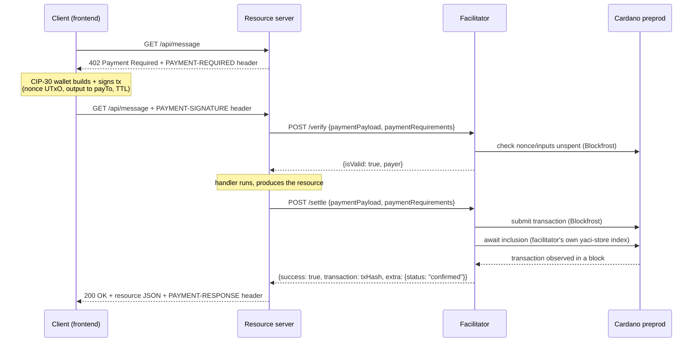

# x402 on Cardano — a payment-per-request demo

A working, end-to-end implementation of the [x402 payment protocol](https://github.com/coinbase/x402) (`exact` scheme, v2, address-to-address) settling in real ADA on **Cardano preprod**. Three components — a browser client, a resource server, and a from-scratch Java facilitator — walk a single HTTP request through the full 402-pay-retry loop, with every protocol artifact shown on screen as it happens.

This is a **from-scratch Java port**, not a wrapper: the facilitator (`facilitator/`) reimplements the x402 core + Cardano `exact` scheme in Spring Boot, using [yaci-store](https://github.com/bloxbean/yaci-store) and [cardano-client-lib](https://github.com/bloxbean/cardano-client-lib) directly. It does not depend on the `org.x402` Java library, which is dead. The frontend and resource server, by contrast, *do* consume the TypeScript reference implementation from the sibling `../x402` repo via local `file:` links — see [Consuming the x402 TypeScript packages](#consuming-the-x402-typescript-packages) below.

## What this demonstrates

x402 turns HTTP 402 Payment Required from a dormant status code into a working payment handshake: a client asks for a resource, the server names its price as a machine-readable JSON header, the client pays and retries, and the server hands back the resource plus a receipt. No accounts, no API keys, no subscription — just a signed transaction attached to a retried GET.

In this demo the resource is a single JSON message, priced at **2 tADA** (2,000,000 lovelace), paid **address-to-address** (`assetTransferMethod: "default"` — no smart contract, just a plain output to the seller's address) on **Cardano preprod**.

**Protocol summary:** the client makes an unauthenticated request; the server replies `402` with a `PAYMENT-REQUIRED` header describing exactly what it will accept (scheme, network, asset, amount, payee address, timeout). The client's wallet builds and signs a Cardano transaction that pays that address, using one of its own UTxOs as an unforgeable, unreplayable **nonce** (spending a UTxO can only ever happen once). The client retries the identical request with a `PAYMENT-SIGNATURE` header carrying the signed transaction. The server doesn't understand Cardano signatures itself — it forwards the payload to a **facilitator**, a specialist service that verifies the transaction is well-formed and correctly pays the server (`/verify`), and — once the server's handler has produced the resource — submits it to the chain and waits for a block to include it (`/settle`). Only then does the server respond `200` with the resource and a `PAYMENT-RESPONSE` header carrying the transaction hash.



The facilitator never holds funds and never signs anything — the client's wallet builds, signs, and pays the transaction fee for the whole transaction; the facilitator only **verifies** the signed transaction against the protocol's rules and **broadcasts** it.

## Components

| Component | Port | x402 role | `../x402` sources consumed / mirrored |
|---|---|---|---|
| `frontend/` | 5173 | Client — builds and signs the payment via a CIP-30 wallet, drives the request/402/pay/retry/settle sequence step by step | Consumes `@x402/core`, `@x402/cardano` (types, `ClientCardanoSigner` interface) via npm `file:` links; implements `Cip30CardanoSigner` against Evolution SDK, mirroring the reference signer's build recipe in `.../mechanisms/cardano/src/signer.ts` |
| `server/` | 4021 | Resource server — names its price, delegates verify/settle to the facilitator, serves the resource once paid | Consumes `@x402/express` (`paymentMiddleware`) and `@x402/cardano` (`ExactCardanoScheme`, server role) via npm `file:` links |
| `facilitator/` | 4022 | Facilitator — verifies signed transactions against the 7 spec rules and settles them on-chain | **Mirrors, does not consume**: a from-scratch Java port of `.../packages/core` (facilitator registry, HTTP envelope) and `.../packages/mechanisms/cardano/src/exact/facilitator` (the `exact` Cardano scheme's verify/settle logic and error codes) |

The frontend and server sit one level below the repo root and consume the sibling `../x402/typescript` workspace's packages as npm `file:` dependencies (see [below](#consuming-the-x402-typescript-packages)) — `setup.sh` builds that workspace once before either app's `npm install` will resolve. The facilitator has zero dependency on `../x402`; it is Java 21 / Spring Boot 3.4.5, built with Gradle, embedding **yaci-store 2.0.0-beta1** (an N2N chain indexer) and **cardano-client-lib** (pinned to **0.7.0-beta2** in `build.gradle` so the whole cardano-client-* stack — CBOR model, crypto, Blockfrost backend, and the version yaci-store itself pulls transitively — resolves to one coherent set of classes).

## The facilitator's correctness story

The facilitator is the part of this demo worth reading carefully — it is a faithful, tested reimplementation of the spec's `exact` Cardano scheme, not a toy.

### The 7 verification rules

All logic lives in `ExactCardanoFacilitatorScheme` (`facilitator/src/main/java/org/x402cardano/facilitator/cardano/ExactCardanoFacilitatorScheme.java`), which ports `.../mechanisms/cardano/src/exact/facilitator/scheme.ts` check-for-check, preserving the TS error-code strings verbatim. `verify()` runs, in order:

1. **Network** — the payload's declared network and the server's requirements must normalize (via CIP-34 alias resolution, e.g. `cip34:0-1` → `cardano:preprod`) to the same supported network; the transaction body's own `networkId` field, if present, must agree too (`network_mismatch`, `invalid_exact_cardano_payload_network_id_mismatch`).
2. **Signed** — the transaction must carry at least one vkey or script witness (`invalid_exact_cardano_payload_unsigned`), and every vkey witness must Ed25519-verify against the blake2b-256 hash of the **raw wire body bytes** — never a re-serialization, which could hash different bytes than what was actually signed (`invalid_exact_cardano_payload_invalid_signature`).
3. **TTL** — if the transaction declares a `ttl` or `validityIntervalStart`, it's checked against the facilitator's own view of the current slot (`invalid_exact_cardano_payload_ttl_expired` / `..._not_yet_valid`).
4. **Nonce-UTxO replay guard** — the payload's `nonce` (`txHash#index`) must be one of the transaction's own inputs (`..._nonce_not_in_inputs`), and that UTxO must currently be unspent on-chain (`..._nonce_not_on_chain`); every *other* declared input must also still be unspent (`..._input_not_available`) — the nonce UTxO's owning address becomes the verified `payer`.
5. **Recipient + asset + amount** — some transaction output must pay the exact `payTo` address at least the required amount (`>=`, overpayment allowed) of the exact asset (`..._recipient_mismatch` / `..._asset_mismatch` / `..._amount_insufficient`).
6. **Min-UTxO** — the matching output must clear Cardano's minimum-ADA-per-UTxO floor, computed from the *live* protocol parameter `coinsPerUtxoByte` (`..._min_utxo_insufficient`) — a transaction that pays exactly 2 tADA but whose output CBOR size pushes it under the floor is rejected even though the amount check passed.
7. **Transfer method** — `assetTransferMethod` is read from the **canonical `requirements.extra`** (never the client-echoed `accepted.extra`, which a malicious client could tamper with) and dispatched to an `AssetTransferMethodVerifier` strategy; `default` (address-to-address) is a no-op, `masumi`/`script` are explicit not-yet-supported stubs.

Failures before the nonce is resolved return `payer: ""`; anything unexpected is caught and mapped to `invalid_exact_cardano_payload_verification_error`.

### Blockfrost vs. embedded yaci-store — the chain-authority split

The facilitator talks to Cardano through two different services, each answering a different *kind* of question (`FacilitatorChainService`, composed in `CompositeChainService`):

- **Blockfrost** (`BlockfrostChainService`) answers **full-UTxO-set questions**: is this specific outref still unspent (nonce + every other input), what are the live protocol parameters (for min-UTxO), and it performs transaction submission. These questions need a complete, authoritative view of chain state that an indexer syncing only from the tip cannot provide — a UTxO could have been spent in a block the facilitator hasn't indexed yet, or could predate where its own sync started.
- **The embedded yaci-store** (`ChainTipTracker` + `TxInclusionTracker`, both in `facilitator/src/main/java/org/x402cardano/facilitator/chain/yaci/`) is the facilitator's **own** chain view, built by syncing N2N from a public preprod relay starting near the tip. It answers two questions Blockfrost is the wrong tool for: the **current slot** for the TTL check (a value the facilitator wants to be able to trust independent of a third party being up), and **settlement confirmation** — "has this transaction actually landed in a block *I* observed?" rather than "does a third-party API say so." `TxInclusionTracker` records `(txHash → slot)` from `TransactionEvent`s and — critically — **invalidates entries beyond a rollback point** on `RollbackEvent` (Ouroboros rollbacks are real; "confirmed" here means "observed in a block that's still part of the best chain," matching the TS reference's semantics, not "was in some block once").

This composition is config-driven (`FacilitatorConfig`), so a future full-sync deployment could hand the UTxO-set checks to yaci-store too without touching the scheme logic.

### Duplicate-settlement cache

`DuplicateSettlementCache` (in-memory, keyed on the base64 transaction string, 120 s TTL, 1024-entry cap) guards the window between claiming a settlement and its on-chain confirmation. `settle()` claims **atomically before submission** (`tryClaim`, CAS-loop) so two concurrent `/settle` calls for the same transaction can never both submit — one gets `success: true`, the other `duplicate_settlement`. If submission itself throws, the claim is **released** so a legitimate retry can proceed; if submission succeeds but confirmation times out, the claim is **kept** (the transaction may still land, and a caller retrying blindly must not cause a second broadcast). The nonce UTxO being spent on-chain is the durable, cross-instance guard against replay; this cache only covers the brief unconfirmed window on a single instance.

### Rollback handling

Because `TxInclusionTracker` is the facilitator's own source of truth for "confirmed," it has to handle the chain reorganizing under it. On every `RollbackEvent` from yaci-store it drops every recorded inclusion at a slot past the rollback point, so a transaction that *was* confirmed in a since-abandoned block stops being confirmed — `awaitInclusion()` (which polls this tracker) will correctly resume waiting rather than reporting a false positive.

## Prerequisites

- **Node.js 20+** and **pnpm** (`npm i -g pnpm` if you don't have it — `setup.sh` needs it to build the sibling `../x402/typescript` workspace).
- **Java 21.** The Gradle wrapper is pinned to Gradle 8.14, which will not run on a JVM newer than 21 (18/25/26 etc. all fail) — point `JAVA_HOME` at a JDK 21 install before running any `./gradlew` command.
- A **Blockfrost preprod project id** — free at [blockfrost.io](https://blockfrost.io). The facilitator uses it for UTxO lookups, protocol parameters, and transaction submission; the frontend uses it (in-browser) for wallet UTxO selection via Evolution SDK.
- A **CIP-30 browser wallet** (Eternl or Lace) set to **preprod**, funded with test ADA from the [Cardano testnets faucet](https://docs.cardano.org/cardano-testnets/tools/faucet).
- A **second preprod address** (can be a second address in the same wallet, or anywhere else you control) to act as the server's `payTo` — the address that receives the 2 tADA each request pays.

## Consuming the x402 TypeScript packages

`@x402/cardano` isn't published to npm, so `server/` and `frontend/` consume the sibling `../x402/typescript` workspace directly. Run `./setup.sh` once — it runs `pnpm install` and builds the four packages this demo needs (`@x402/core`, `@x402/cardano`, `@x402/express`, `@x402/fetch`) via `turbo run build` (scoped to just those packages plus dependencies, since the workspace's `site` docs package has an unrelated pre-existing build failure that would abort a full `pnpm build`).

`server/package.json` and `frontend/package.json` then depend on those packages via npm `file:` links, e.g.:

```json
"@x402/core": "file:../../x402/typescript/packages/core",
"@x402/cardano": "file:../../x402/typescript/packages/mechanisms/cardano"
```

npm symlinks each `file:` dependency to its source package directory, so it never has to resolve the packages' internal `workspace:~` specs itself — Node resolves those transitive deps through pnpm's `node_modules` inside the `../x402` monorepo, which is why `./setup.sh` must run first. This direct `file:` link path works as-is; no tarball fallback was needed for this repo. (If npm ever rejects a transitive `workspace:` spec in your environment, the fallback is `pnpm --filter <pkg> pack --pack-destination <dir>` in `../x402/typescript`, pointing the demo's dependency at the resulting `.tgz`, plus an npm `"overrides"` entry so `@x402/cardano` doesn't try to resolve `@x402/core` from the registry.)

## Run it

Run these in order, each in its own terminal.

**1. Build the x402 TypeScript workspace (once):**

```bash
./setup.sh
```

**2. Facilitator** — point `JAVA_HOME` at a JDK 21, provide your Blockfrost project id:

```bash
cd facilitator
JAVA_HOME=/path/to/jdk-21 BLOCKFROST_PROJECT_ID=<your-preprod-project-id> ./gradlew bootRun
```

Wait until `curl localhost:4022/health` returns `{"status":"ok",...}` (it starts as `"syncing"` while the embedded yaci-store catches up to the tip — `ok` means its last-seen block is under 90 s old). `GET /supported` should return the `exact` / `cardano:preprod` kind immediately, even while still syncing.

**3. Resource server:**

```bash
cd server
cp .env.example .env   # set SERVER_CARDANO_ADDRESS to your second preprod address
npm install
npm run dev
```

**4. Frontend:**

```bash
cd frontend
cp .env.example .env   # set VITE_BLOCKFROST_PROJECT_ID to your Blockfrost project id
npm install
npm run dev
```

Open **http://localhost:5173**, connect your preprod wallet, and walk through the payment.

## What to watch

The frontend walks the protocol in five steps, each showing its own artifact:

1. **The unpaid request** — `GET /api/message` with no headers; the server has no way to know you want to pay yet.
2. **Server names its price** — the `402` response's decoded `PAYMENT-REQUIRED` header: scheme, network, amount, `payTo`, timeout.
3. **Wallet builds and signs** — your CIP-30 wallet is asked to sign a transaction that spends one of your UTxOs as the nonce and pays the server's address; nothing is broadcast yet.
4. **Retried with proof of payment** — the identical `GET` fires again with a `PAYMENT-SIGNATURE` header carrying the signed transaction, base64-encoded.
5. **Confirmed on-chain** — the facilitator submits and waits for block inclusion (typically 20–60 s on preprod); the response finally carries the resource JSON plus a `PAYMENT-RESPONSE` header with the transaction hash — click through to Cardanoscan preprod (`https://preprod.cardanoscan.io/transaction/<hash>`) to see it for real.

Meanwhile, watch the facilitator's own logs: you'll see it work through `/verify` (one log line per check as it dispatches to Blockfrost for UTxO lookups) and then `/settle` (submission, followed by polling its own yaci-store index until the transaction shows up in a block).

## Extending

- **Adding a transfer method** (e.g. `masumi`, `script`, or a custom escrow contract): implement `AssetTransferMethodVerifier` (`facilitator/src/main/java/org/x402cardano/facilitator/cardano/AssetTransferMethodVerifier.java`) — `supports(method)` + `check(extra, requirements, tx, payer)` — and add it to the list `ExactCardanoFacilitatorScheme` consults. `DefaultTransferVerifier` is the reference no-op implementation for `default` (address-to-address).
- **Adding a network** (e.g. `cardano:mainnet`, `cardano:preview`): both are already recognized by `CardanoNetworks` (CIP-34 alias resolution + `networkId()` mapping); register a second `ExactCardanoFacilitatorScheme` instance against the new network in `X402FacilitatorRegistry` (`FacilitatorConfig`), pointed at chain services configured for that network.
- **Running this facilitator against the upstream x402 conformance suite**: `../x402/e2e/facilitators/external-proxies/` is built for exactly this — wire this facilitator's `http://localhost:4022` endpoints in as an external proxy per that directory's README and run the e2e suite against a real implementation instead of the TS reference facilitator.

## Troubleshooting

- **`./gradlew` fails to launch / weird JVM errors:** you're on a JDK newer (or older) than 21. Gradle 8.14 (this project's pinned wrapper version) does not run on Java 18+ (other than 21) reliably in this setup — set `JAVA_HOME` to a JDK 21 install for every `./gradlew` invocation.
- **`npm install` fails to resolve `@x402/cardano` or a transitive `workspace:` specifier:** you skipped `./setup.sh`, or your npm version resolves `file:` links differently than expected. Re-run `./setup.sh` from the repo root first; if it still fails, use the `pnpm pack` tarball fallback described in [Consuming the x402 TypeScript packages](#consuming-the-x402-typescript-packages).
- **Blockfrost `402`/`429` responses:** you've hit your Blockfrost project's rate limit or daily cap (the free tier is generous but not unlimited, and this demo calls it on every verify/settle). Wait for the window to reset, or use a project with a higher tier.
- **Facilitator `/health` stuck on `"syncing"` for a long time, or verify/settle behaving oddly after restarts:** the embedded yaci-store keeps its H2 index under `facilitator/data/`. If it gets into a bad state (e.g. after an unclean shutdown mid-sync), stop the facilitator and delete `facilitator/data/` to force a clean resync from the tip.
- **Wallet is connected but nothing works / transactions fail to build:** your CIP-30 wallet is very likely set to **mainnet** instead of **preprod** — check the wallet's network setting; the frontend expects preprod addresses (`addr_test1...`) throughout.

---

*Facilitator test suite: 69 tests, all green (`cd facilitator && JAVA_HOME=<jdk21> ./gradlew test`). `server` and `frontend` both pass `npm run typecheck`; `frontend` also passes `npm run build`. The full live payment flow (connect wallet → pay real preprod tADA → settle → see it on Cardanoscan) is the one step that needs your own Blockfrost project id and a funded wallet — everything else in this README has been verified end-to-end short of that.*
