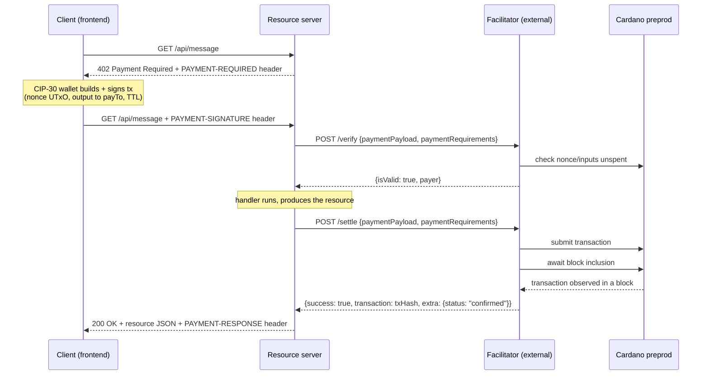

# x402 on Cardano — a payment-per-request demo

A working, end-to-end demo of the [x402 payment protocol](https://github.com/coinbase/x402) (`exact` scheme, v2) settling in real ADA on **Cardano preprod**. Two components — a browser client and a resource server — walk a single HTTP request through the full 402-pay-retry loop, with every protocol artifact shown on screen as it happens.

The third role in the protocol, the **facilitator**, is *not* shipped here: you point the resource server at one you run or host yourself. See [Bring your own facilitator](#bring-your-own-facilitator).

Both components consume the TypeScript reference implementation from the sibling `../x402` repo via local `file:` links — see [Consuming the x402 TypeScript packages](#consuming-the-x402-typescript-packages).

## What this demonstrates

x402 turns HTTP 402 Payment Required from a dormant status code into a working payment handshake: a client asks for a resource, the server names its price as a machine-readable header, the client pays and retries, and the server hands back the resource plus a receipt. No accounts, no API keys, no subscription — just a signed transaction attached to a retried GET.

In this demo the resource is a single JSON message, priced at **2 tADA** (2,000,000 lovelace), paid **address-to-address** (`assetTransferMethod: "default"` — no smart contract, just a plain output to the seller's address) on **Cardano preprod**. A second route demonstrates the [masumi escrow-lock method](#the-masumi-escrow-lock-method).

**Protocol summary:** the client makes an unauthenticated request; the server replies `402` with a `PAYMENT-REQUIRED` header describing exactly what it will accept (scheme, network, asset, amount, payee address, timeout). The client's wallet builds and signs a Cardano transaction that pays that address, using one of its own UTxOs as an unforgeable, unreplayable **nonce** (spending a UTxO can only ever happen once). The client retries the identical request with a `PAYMENT-SIGNATURE` header carrying the signed transaction. The server doesn't understand Cardano signatures itself — it forwards the payload to a **facilitator**, a specialist service that verifies the transaction is well-formed and correctly pays the server (`/verify`), and — once the server's handler has produced the resource — submits it to the chain and waits for a block to include it (`/settle`). Only then does the server respond `200` with the resource and a `PAYMENT-RESPONSE` header carrying the transaction hash.



A facilitator never holds funds and never signs anything — the client's wallet builds, signs, and pays the transaction fee for the whole transaction; the facilitator only **verifies** the signed transaction against the protocol's rules and **broadcasts** it.

## Components

| Component | Port | x402 role | `../x402` sources consumed |
|---|---|---|---|
| `frontend/` | 5173 | Client — builds and signs the payment via a CIP-30 wallet, drives the request/402/pay/retry/settle sequence step by step | `@x402/core`, `@x402/cardano` (types, `ClientCardanoSigner` interface) via npm `file:` links; implements a CIP-30 signer against Evolution SDK, mirroring the reference signer's build recipe in `.../mechanisms/cardano/src/signer.ts` |
| `server/` | 4021 | Resource server — names its price, delegates verify/settle to the facilitator, serves the resource once paid | `@x402/express` (`paymentMiddleware`) and `@x402/cardano` (`ExactCardanoScheme`, server role) via npm `file:` links |

Both sit one level below the repo root and consume the sibling `../x402/typescript` workspace's packages as npm `file:` dependencies — `setup.sh` builds that workspace once before either app's `npm install` will resolve.

## Bring your own facilitator

This demo ships no facilitator. `server/.env`'s **`FACILITATOR_URL` is required** — point it at an x402 facilitator whose `GET /supported` advertises:

```json
{ "x402Version": 2, "scheme": "exact", "network": "cardano:preprod" }
```

The resource server calls `/supported` at startup and refuses to serve its paid routes if that kind is missing, so a wrong or unreachable URL fails fast at boot rather than mid-payment.

**Note there is no public hosted x402 facilitator that supports Cardano.** The library's built-in default (`https://x402.org/facilitator`) serves EVM/SVM networks only — pointing at it will fail the `/supported` check.

The one Cardano-capable implementation in the x402 tree is the **TypeScript reference facilitator** at `../x402/e2e/facilitators/typescript`, which supports `exact` on `cardano:preprod` and implements the masumi transfer method too. To run it locally on port 4022:

```bash
cd ../x402/e2e/facilitators/typescript
pnpm install
EVM_PRIVATE_KEY=0x0000000000000000000000000000000000000000000000000000000000000001 \
SVM_PRIVATE_KEY=<any-well-formed-svm-key> \
BLOCKFROST_PROJECT_ID=<your-preprod-project-id> \
BLOCKFROST_PREPROD_URL=https://cardano-preprod.blockfrost.io/api/v0 \
CARDANO_NETWORK=cardano:preprod \
pnpm start
```

Then set `FACILITATOR_URL=http://localhost:4022` in `server/.env`.

Two things about that command: it registers Cardano only when `BLOCKFROST_PROJECT_ID` is set, and it **hard-exits without `EVM_PRIVATE_KEY` and `SVM_PRIVATE_KEY`** even for a Cardano-only run — hence the throwaway values above (they're never used for a Cardano payment; the facilitator needs no funds on any chain, it only broadcasts what the client already signed).

## Prerequisites

- **Node.js 20+** and **pnpm** (`npm i -g pnpm` — `setup.sh` needs it to build the sibling `../x402/typescript` workspace).
- **An x402 facilitator supporting `exact` on `cardano:preprod`** — see [above](#bring-your-own-facilitator).
- A **Blockfrost preprod project id** — free at [blockfrost.io](https://blockfrost.io). The frontend uses it (in-browser) for wallet UTxO selection and protocol parameters via Evolution SDK; your facilitator will need chain access of its own too.
- A **CIP-30 browser wallet** (Eternl or Lace) set to **preprod**, funded with test ADA from the [Cardano testnets faucet](https://docs.cardano.org/cardano-testnets/tools/faucet).
- A **second preprod address** (a second address in the same wallet, or anywhere else you control) to act as the server's `payTo` — the address that receives the 2 tADA each request pays.

## Consuming the x402 TypeScript packages

`@x402/cardano` isn't published to npm, so `server/` and `frontend/` consume the sibling `../x402/typescript` workspace directly. Run `./setup.sh` once — it runs `pnpm install` and builds the four packages this demo needs (`@x402/core`, `@x402/cardano`, `@x402/express`, `@x402/fetch`) via `turbo run build` (scoped to just those packages plus dependencies, since the workspace's `site` docs package has an unrelated pre-existing build failure that would abort a full `pnpm build`).

`server/package.json` and `frontend/package.json` then depend on those packages via npm `file:` links, e.g.:

```json
"@x402/core": "file:../../x402/typescript/packages/core",
"@x402/cardano": "file:../../x402/typescript/packages/mechanisms/cardano"
```

npm symlinks each `file:` dependency to its source package directory, so it never has to resolve the packages' internal `workspace:~` specs itself — Node resolves those transitive deps through pnpm's `node_modules` inside the `../x402` monorepo, which is why `./setup.sh` must run first. (If npm ever rejects a transitive `workspace:` spec in your environment, the fallback is `pnpm --filter <pkg> pack --pack-destination <dir>` in `../x402/typescript`, pointing the demo's dependency at the resulting `.tgz`, plus an npm `"overrides"` entry so `@x402/cardano` doesn't try to resolve `@x402/core` from the registry.)

## Run it

Run these in order, each in its own terminal.

**1. Build the x402 TypeScript workspace (once):**

```bash
./setup.sh
```

**2. Start your facilitator** — see [Bring your own facilitator](#bring-your-own-facilitator). Confirm it's up and Cardano-capable before continuing:

```bash
curl -s localhost:4022/supported | grep cardano:preprod
```

**3. Resource server:**

```bash
cd server
cp .env.example .env   # set SERVER_CARDANO_ADDRESS and FACILITATOR_URL
npm install
npm run dev
```

**4. Frontend:**

```bash
cd frontend
cp .env.example .env   # set VITE_BLOCKFROST_PROJECT_ID to your Blockfrost project id
npm install
npm run dev
```

Open **http://localhost:5173**, connect your preprod wallet, and walk through the payment.

> Start the facilitator **before** the server. The server validates `/supported` at boot, so starting it first produces `ECONNREFUSED ...:4022` and a `no supported payment kinds loaded from any facilitator` error.

## What to watch

The frontend walks the protocol in five steps, each showing its own artifact:

1. **The unpaid request** — `GET /api/message` with no headers; the server has no way to know you want to pay yet.
2. **Server names its price** — the `402` response's decoded `PAYMENT-REQUIRED` header: scheme, network, amount, `payTo`, timeout.
3. **Wallet builds and signs** — your CIP-30 wallet is asked to sign a transaction that spends one of your UTxOs as the nonce and pays the server's address; nothing is broadcast yet.
4. **Retried with proof of payment** — the identical `GET` fires again with a `PAYMENT-SIGNATURE` header carrying the signed transaction, base64-encoded.
5. **Confirmed on-chain** — the facilitator submits and waits for block inclusion (typically 20–60 s on preprod); the response finally carries the resource JSON plus a `PAYMENT-RESPONSE` header with the transaction hash — click through to Cardanoscan preprod (`https://preprod.cardanoscan.io/transaction/<hash>`) to see it for real.

Watch your facilitator's logs alongside: you'll see it work through `/verify` (checking the nonce and every other input is still unspent) and then `/settle` (submission, then waiting for the transaction to appear in a block).

## The masumi escrow-lock method

Alongside the default address-to-address transfer, this demo also exercises a second `assetTransferMethod`: **`masumi`**, modeled on the [Masumi](https://www.masumi.network/) agent-payment protocol's escrow lock. Instead of a plain output to the seller, the client's wallet pays into an escrow — Masumi's `vested_pay` validator — carrying a **19-field inline Plutus datum** that records the purchase: buyer/seller addresses, a reference key + signature, buyer/seller nonces, an agent identifier, and four lifecycle timestamps (`pay_by_time`, `submit_result_time`, `unlock_time`, `external_dispute_unlock_time`). x402 here only covers the **lock** — releasing the escrow later (paying the seller, refunding the buyer, or resolving a dispute) is a separate on-chain action outside this demo's scope.

**Try it:** in Step B, pick **"Masumi escrow-lock (5 tADA)"** instead of **"Address-to-address (2 tADA)"** before running the flow. The identical five-step protocol runs — only the requested route, the transaction's output, and the settlement's meaning differ; the UI calls this out inline (the timeline's final step reads "confirmed" as "locked in escrow," not "paid to the seller").

Your facilitator must implement the masumi rules for this route to verify — the TS reference facilitator does.

**Dummy purchase data.** A real Masumi purchase is registered through the Masumi Payment Service, which issues the reference key/signature, nonces, and lifecycle timestamps that make a lock claimable. This demo has no such service to call, so it fabricates fixed, plausible-looking values instead — every one is marked `// DUMMY:` in code (`grep -rn "// DUMMY:" server/src frontend/src`), in two places that must agree byte-for-byte:
- **Server** — `server/src/server.ts`, the `GET /api/message-masumi` route's `extra` block: `referenceKey`, `referenceSignature`, `identifierFromPurchaser`, `sellerNonce`, `agentIdentifier`, `inputHash`, `collateralReturnLovelace`, and the four timestamps.
- **Frontend** — `frontend/src/x402/masumiDatum.ts`, which copies those same `extra` values verbatim into the inline datum it builds.

(`sellerAddress`/`contractAddress` — the server's own preprod address — and `paymentType: "Web3CardanoV2"`, a required constant, are real, not dummy.)

**The escrow is a recoverable stand-in, not the real contract.** `MASUMI_ESCROW_ADDRESS` (`server/.env.example`) defaults to `SERVER_CARDANO_ADDRESS` when unset — a plain preprod address the operator controls, not the deployed `vested_pay` script address. That lets the demo lock funds and later reclaim them manually, at the cost of not actually enforcing Masumi's spending conditions on-chain. A real deployment would point `MASUMI_ESCROW_ADDRESS` at the real script address for the target network instead.

**Two routes, one scheme.** `GET /api/message` advertises `extra.assetTransferMethod: "default"` (2 tADA, plain output); `GET /api/message-masumi` advertises `extra.assetTransferMethod: "masumi"` (5 tADA — comfortably clear of the higher min-UTxO a datum-bearing output requires). Both are served by the same `ExactCardanoScheme`; the facilitator dispatches on the **canonical requirements'** `extra.assetTransferMethod`, never the client-echoed copy.

**Known risk: cross-component datum parity.** The frontend builds the 19-field datum with Evolution SDK; your facilitator parses it with whatever CBOR stack it uses. The two can emit CBOR differently (Evolution uses indefinite-length encoding, some parsers definite-length), which is why a facilitator should compare datum fields **structurally**, never by raw hex. If a masumi payment is rejected with `invalid_exact_cardano_payload_masumi_datum_invalid`, the likely culprit is the address-datum encoding (fields 0/`buyer` and 2/`seller`) — the fragile part of a hand-rolled address-to-`Constr` conversion — see `frontend/src/x402/masumiDatum.ts`, which guards it with a 28-byte credential-hash assertion.

## Extending

- **Adding another transfer method** (e.g. a custom escrow contract): add the method's fields to the route's `extra` in `server/src/server.ts`, teach `frontend/src/x402/masumiDatum.ts` (or a sibling builder) to construct whatever the output needs, and make sure your facilitator implements the matching verification — `@x402/cardano`'s facilitator-role scheme dispatches on `extra.assetTransferMethod` and is the place to add it.
- **Adding a network** (e.g. `cardano:mainnet`, `cardano:preview`): change `network` on the route's `accepts` in `server/src/server.ts` and the frontend's chain/preset, and point `FACILITATOR_URL` at a facilitator advertising that network in `/supported`.
- **Swapping facilitators**: it's a single env var. Anything speaking the x402 v2 facilitator HTTP contract (`POST /verify`, `POST /settle`, `GET /supported`) and advertising `exact` on your network will work.

## Troubleshooting

- **`ECONNREFUSED` / `no supported payment kinds loaded from any facilitator` at server startup:** your facilitator isn't running, `FACILITATOR_URL` points somewhere wrong, or it doesn't advertise `exact` on `cardano:preprod`. Start it first and confirm with `curl -s $FACILITATOR_URL/supported`.
- **The client shows `Payment failed: HTTP 402 — {}`:** that empty body is all `paymentMiddleware` ever returns on a payment failure — **the real reason is in the server's log**. Look for the `[facilitator]` line immediately above the `[server] ... 402 with a payment attached` line; it prints the facilitator's own `invalidReason`/`errorReason` (e.g. `invalid_exact_cardano_payload_nonce_not_on_chain`, `..._ttl_expired`, `..._min_utxo_insufficient`, `unsupported_scheme`) plus the amount, `payTo`, `assetTransferMethod`, and nonce it was judging. Common causes: the wallet's chosen nonce UTxO was already spent (re-run the flow to pick a fresh one), the facilitator can't reach its chain provider (`..._chain_lookup_failed`), or — on the masumi route — the facilitator doesn't implement the masumi transfer method.
- **`npm install` fails to resolve `@x402/cardano` or a transitive `workspace:` specifier:** you skipped `./setup.sh`, or your npm version resolves `file:` links differently than expected. Re-run `./setup.sh` from the repo root first; if it still fails, use the `pnpm pack` tarball fallback described in [Consuming the x402 TypeScript packages](#consuming-the-x402-typescript-packages).
- **Blockfrost `402`/`429` responses:** you've hit your Blockfrost project's rate limit or daily cap. Wait for the window to reset, or use a project with a higher tier.
- **Wallet is connected but nothing works / transactions fail to build:** your CIP-30 wallet is very likely set to **mainnet** instead of **preprod** — check the wallet's network setting; the frontend expects preprod addresses (`addr_test1...`) throughout.

---

*`server` and `frontend` both pass `npm run typecheck`; `frontend` also passes `npm run build`. The full live payment flow (connect wallet → pay real preprod tADA → settle → see it on Cardanoscan) needs your own facilitator, Blockfrost project id, and a funded wallet.*

*A from-scratch Java/Spring Boot facilitator (yaci-store + cardano-client-lib, 85 tests) previously lived in this repo under `facilitator/`. It was removed in favour of pointing at an external facilitator; it remains in this branch's git history if you want it back — `git log -- facilitator/`.*
