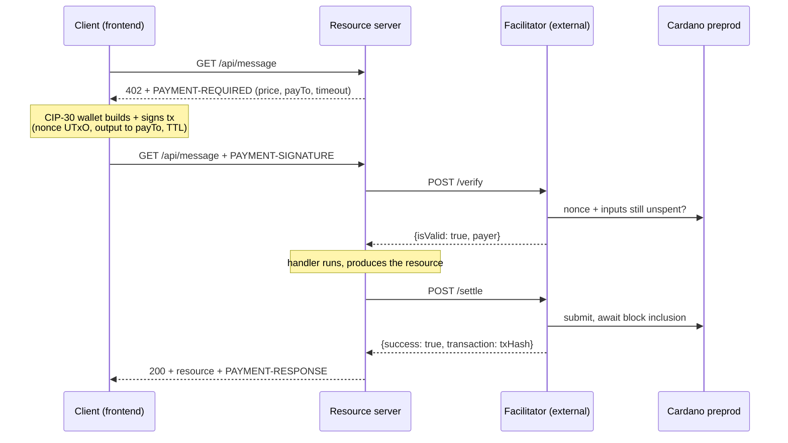

# x402 on Cardano — a payment-per-request demo

An end-to-end demo of the [x402 payment protocol](https://github.com/coinbase/x402) (`exact` scheme, v2) settling real ADA on **Cardano preprod**. A browser client and a resource server walk one HTTP request through the full 402 → pay → retry loop, showing every protocol artifact on screen as it happens.

**This repo ships two of the three x402 roles.** The **facilitator** is external — you must run one and point the server at it.

## You need an external facilitator

The resource server delegates payment verification and on-chain settlement to a facilitator. `FACILITATOR_URL` is **required**; point it at an x402 facilitator whose `GET /supported` advertises:

```json
{ "x402Version": 2, "scheme": "exact", "network": "cardano:preprod" }
```

The server checks this at startup and refuses to serve its paid routes otherwise, so a wrong or unreachable URL fails fast at boot instead of mid-payment.

**Reference implementation: [Kammerlo/cardano-x402-facilitator](https://github.com/Kammerlo/cardano-x402-facilitator)** — a Cardano facilitator built for this demo. Follow its README to run it, then set `FACILITATOR_URL` to its address.

> There is no public *hosted* x402 facilitator that supports Cardano. The x402 library's built-in default (`https://x402.org/facilitator`) serves EVM/SVM only — pointing at it fails the `/supported` check. The TypeScript reference facilitator in the x402 monorepo (`../x402/e2e/facilitators/typescript`) also speaks Cardano if you'd rather run that one.

## Quick start

```bash
./setup.sh                        # 1. build the sibling ../x402/typescript packages (once)
                                  # 2. start your facilitator (see above), then:
cd server   && cp .env.example .env && npm install && npm run dev    # :4021
cd frontend && cp .env.example .env && npm install && npm run dev    # :5173
```

Fill in the two `.env` files first:

| File | Set |
|---|---|
| `server/.env` | `SERVER_CARDANO_ADDRESS` (a preprod address you control — receives the payments) and `FACILITATOR_URL` |
| `frontend/.env` | `VITE_BLOCKFROST_PROJECT_ID` (free at [blockfrost.io](https://blockfrost.io) — the browser uses it to select wallet UTxOs) |

Then open **http://localhost:5173**, connect a **preprod** CIP-30 wallet (Eternl/Lace) funded from the [testnet faucet](https://docs.cardano.org/cardano-testnets/tools/faucet), and run the flow.

**Start the facilitator before the server** — the server validates `/supported` at boot, so the other order gives `ECONNREFUSED` and `no supported payment kinds loaded from any facilitator`.

Prerequisites: Node 20+, pnpm (`npm i -g pnpm`, needed by `setup.sh`), a Blockfrost preprod project id, and a funded preprod CIP-30 wallet.

## How it works

The client requests a resource; the server answers `402` with a `PAYMENT-REQUIRED` header naming its price. The wallet builds and signs a Cardano transaction paying that address, spending one of its own UTxOs as an unforgeable **nonce** (a UTxO can only be spent once — that's the replay guard). The client retries with the signed transaction in a `PAYMENT-SIGNATURE` header. The server forwards it to the facilitator to `/verify`, runs its handler, then asks the facilitator to `/settle` — submit it and wait for a block. Only then does it return `200` with the resource and a `PAYMENT-RESPONSE` receipt.



The facilitator never holds funds and never signs — the client's wallet pays the transaction fee and signs everything. The facilitator only verifies and broadcasts.

## Components

| Component | Port | Role |
|---|---|---|
| `frontend/` | 5173 | Client — CIP-30 wallet signing via Evolution SDK, step-by-step protocol walkthrough UI |
| `server/` | 4021 | Resource server — names the price, delegates verify/settle, serves the resource once paid |

Both consume the sibling `../x402/typescript` workspace via npm `file:` links (`@x402/core`, `@x402/cardano`, `@x402/express`), which is why `./setup.sh` must run before `npm install`. `@x402/cardano` isn't on npm, so there's no registry alternative. (If npm ever rejects a transitive `workspace:` spec, fall back to `pnpm --filter <pkg> pack` in `../x402/typescript` and point the dependency at the `.tgz`.)

## Two payment methods

`GET /api/message` — **2 tADA, address-to-address** (`assetTransferMethod: "default"`): a plain output to the seller. This is the default path.

`GET /api/message-masumi` — **5 tADA, escrow lock** (`assetTransferMethod: "masumi"`): modeled on [Masumi](https://www.masumi.network/)'s agent-payment escrow. Instead of paying the seller, the wallet locks the ADA into an escrow output carrying a **19-field inline Plutus datum** (buyer/seller, reference key + signature, nonces, agent id, four lifecycle timestamps). x402 covers only the **lock**; releasing it later is out of scope. Pick it in the UI's Step B before running the flow. Your facilitator must implement the masumi rules for this route to verify.

Two caveats on the masumi route, both deliberate for a demo:

- **The purchase data is fake.** A real Masumi lock gets its reference key/signature, nonces, and timestamps from the Masumi Payment Service. This demo fabricates fixed values — every one marked `// DUMMY:` in code (`grep -rn "// DUMMY:" server/src frontend/src`), in the server's route `extra` and copied verbatim into the datum by `frontend/src/x402/masumiDatum.ts`. The two must agree byte-for-byte or the facilitator rejects the lock.
- **The escrow is a recoverable stand-in.** `MASUMI_ESCROW_ADDRESS` defaults to `SERVER_CARDANO_ADDRESS` — a plain address you control, not the real `vested_pay` script — so demo funds stay reclaimable. A real deployment would point it at the actual script address.

## Troubleshooting

- **Client shows `Payment failed: HTTP 402 — {}`** — that empty body is all `paymentMiddleware` returns on failure; **the real reason is in the server log**. Find the `[facilitator]` line above `[server] ... 402 with a payment attached` — it prints the facilitator's `invalidReason`/`errorReason` plus the amount, `payTo`, method, and nonce it judged. Usual suspects: the nonce UTxO was already spent (re-run to pick a fresh one), the facilitator can't reach its chain provider, or — on the masumi route — it doesn't implement masumi.
- **`ECONNREFUSED` / `no supported payment kinds loaded from any facilitator` at startup** — facilitator not running, wrong `FACILITATOR_URL`, or it doesn't advertise `exact` on `cardano:preprod`. Check with `curl -s $FACILITATOR_URL/supported`.
- **`npm install` can't resolve `@x402/cardano`** — you skipped `./setup.sh`. Run it from the repo root first.
- **Wallet connected but transactions won't build** — the wallet is almost certainly on **mainnet**; switch it to preprod (`addr_test1...`).
- **Blockfrost `402`/`429`** — rate limit or daily cap hit; wait or use a higher tier.

---

*`server` and `frontend` both pass `npm run typecheck`; `frontend` also passes `npm run build`. The full live payment (wallet → real preprod tADA → settled on Cardanoscan) needs your own facilitator, Blockfrost id, and a funded wallet.*

*A Java/Spring Boot facilitator (yaci-store + cardano-client-lib, 85 tests) previously lived here under `facilitator/`; it was moved out in favour of pointing at an external one, and remains in this branch's git history — `git log -- facilitator/`.*
