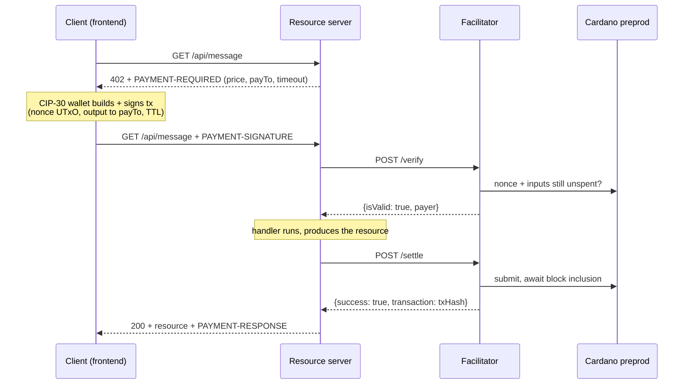

# x402 on Cardano — a payment-per-request demo

An end-to-end demo of the [x402 payment protocol](https://github.com/coinbase/x402) (`exact` scheme, v2) settling real ADA on **Cardano preprod**. A browser client, a resource server, and a facilitator walk one HTTP request through the full 402 → pay → retry loop, showing every protocol artifact on screen as it happens.

All three x402 roles run locally: the browser **client**, the resource **server**, and a deliberately minimal **facilitator**.

## The facilitator

The resource server can't validate a Cardano transaction itself, so it delegates to a facilitator: `/verify` (does this signed tx really pay the seller, un-replayed?) and `/settle` (submit it, wait for a block).

`facilitator/` is the smallest spec-compatible implementation — **~150 lines, no protocol logic of its own**. `@x402/cardano` already ships the reference facilitator-role scheme (all nine verification rules, the nonce/replay guard, the canonical-txid duplicate-settlement cache, the submission/confirmation policies and the masumi checks); this is just the HTTP surface the spec defines wired to it. Compatibility comes from reusing the reference implementation rather than re-deriving it.

It **holds no funds and signs nothing** — the client's wallet pays the fee and signs everything, so the facilitator needs only a Blockfrost project id to read chain state and broadcast (no mnemonic, no keys).

**Swapping it out** is one env var: `FACILITATOR_URL` accepts any facilitator whose `GET /supported` advertises `{ "x402Version": 2, "scheme": "exact", "network": "cardano:preprod" }`. The server checks this at startup and refuses to serve paid routes otherwise, so a wrong URL fails fast at boot. A fuller alternative is [Kammerlo/cardano-x402-facilitator](https://github.com/Kammerlo/cardano-x402-facilitator).

> Note there is no public *hosted* x402 facilitator that supports Cardano — the library's built-in default (`https://x402.org/facilitator`) serves EVM/SVM only.

## Quick start

```bash
./setup.sh                          # build the sibling ../x402/typescript packages (once)

# then one terminal each, in this order:
cd facilitator && cp .env.example .env && npm install && npm run dev   # :4022
cd server      && cp .env.example .env && npm install && npm run dev   # :4021
cd frontend    && cp .env.example .env && npm install && npm run dev   # :5173
```

Fill in the three `.env` files first:

| File | Set |
|---|---|
| `facilitator/.env` | `BLOCKFROST_PROJECT_ID` (free at [blockfrost.io](https://blockfrost.io)) |
| `server/.env` | `SERVER_CARDANO_ADDRESS` (a preprod address you control — receives the payments). `FACILITATOR_URL` already points at the local facilitator. |
| `frontend/.env` | `VITE_BLOCKFROST_PROJECT_ID` (the browser uses it to select wallet UTxOs) |

Then open **http://localhost:5173**, connect a **preprod** CIP-30 wallet (Eternl/Lace) funded from the [testnet faucet](https://docs.cardano.org/cardano-testnets/tools/faucet), and run the flow.

**Start the facilitator before the server** — the server validates `/supported` at boot, so the other order gives `ECONNREFUSED` and `no supported payment kinds loaded from any facilitator`.

Prerequisites: Node 20+, pnpm (`npm i -g pnpm`, needed by `setup.sh`), a Blockfrost preprod project id, and a funded preprod CIP-30 wallet.

## How it works

The client requests a resource; the server answers `402` with a `PAYMENT-REQUIRED` header naming its price. The wallet builds and signs a Cardano transaction paying that address, spending one of its own UTxOs as an unforgeable **nonce** (a UTxO can only be spent once — that's the replay guard). The client retries with the signed transaction in a `PAYMENT-SIGNATURE` header. The server forwards it to the facilitator to `/verify`, runs its handler, then asks the facilitator to `/settle` — submit it and wait for a block. Only then does it return `200` with the resource and a `PAYMENT-RESPONSE` receipt.



The facilitator never holds funds and never signs — the client's wallet pays the transaction fee and signs everything. The facilitator only verifies and broadcasts.

## Components

| Component | Port | Role |
|---|---|---|
| `frontend/` | 5173 | Client — CIP-30 wallet signing via Evolution SDK, step-by-step protocol walkthrough UI |
| `server/` | 4021 | Resource server — names the price, delegates verify/settle, serves the resource once paid |
| `facilitator/` | 4022 | Facilitator — `/verify`, `/settle`, `/supported` over `@x402/cardano`'s reference scheme |

All three consume the sibling `../x402/typescript` workspace via npm `file:` links (`@x402/core`, `@x402/cardano`, `@x402/express`), which is why `./setup.sh` must run before `npm install`. `@x402/cardano` isn't on npm, so there's no registry alternative. (If npm ever rejects a transitive `workspace:` spec, fall back to `pnpm --filter <pkg> pack` in `../x402/typescript` and point the dependency at the `.tgz`.)

## Four payment routes

`GET /api/message` — **2 tADA, address-to-address** (`assetTransferMethod: "default"`): a plain output to the seller. This is the default path.

`GET /api/message-usdm` — **0.10 tUSDM, address-to-address**: the same transfer method, but priced in a **native token** instead of ADA. x402 names assets as `policyId.assetNameHex`, so the 402 advertises `e675b46e….0014df10745553444d` (tUSDM, 6 decimals) rather than `lovelace`. The wallet builds a multi-asset output and `autoMinUtxo` adds the ~1.2–1.5 ADA of min-UTxO a token output must carry alongside the token. Nothing changes in the facilitator — it compares whatever asset the requirements name, so native tokens work without a code change.

> **Your wallet must actually hold preprod tUSDM** for this route, and note that *more than one* tUSDM-named token exists on preprod. The default is `@x402/cardano`'s constant; override it with `USDM_ASSET` in `server/.env` to match what you hold. To see your wallet's tokens:
> ```bash
> curl -s "https://preprod.koios.rest/api/v1/address_assets?_addresses=addr_test1..." | head
> ```

`GET /api/message-masumi` — **5 tADA, escrow lock** (`assetTransferMethod: "masumi"`): modeled on [Masumi](https://www.masumi.network/)'s agent-payment escrow. Instead of paying the seller, the wallet locks the ADA into an escrow output carrying a **19-field inline Plutus datum** (buyer/seller, the seller's COSE key + signature, nonces, agent id, collateral, the request hash, four lifecycle timestamps and the `FundsLocked` state). x402 covers only the **lock**; releasing it later is governed by the escrow contract and is out of scope. Pick it in the UI's Step B before running the flow. The included facilitator verifies these locks (the masumi rules come with `@x402/cardano`'s scheme); a substitute facilitator must implement them too.

`GET /api/message-masumi-usdm` — **0.25 tUSDM, escrow lock**: the two extensions combined — a Masumi lock whose value is a native token. This one case can't rely on `autoMinUtxo`: the requested amount is the *token*, so the escrow output's lovelace is purely structural and must clear the **post-result** min-UTxO (the datum grows once `result_hash` is filled) and cover the collateral. The client computes it as `collateral_return_lovelace` via `buildMasumiLock()` from `@x402/cardano`, using live protocol parameters — the seller never supplies or signs that field, and the escrow output must carry exactly `requestedLovelace + collateral`.

### What the masumi route actually does now

Two things changed with the current spec, and both are load-bearing:

- **The escrow address is derived, not chosen.** The facilitator applies the deployment parameters (`required_admins_multi_sig`, `admin_vks`, `cooldown_period`) to the canonical `vested_pay` blueprint, derives the script address itself, and requires `payTo` to equal it — a look-alike escrow with different admins is a different trust domain. There is no `MASUMI_ESCROW_ADDRESS` any more, and **no recoverable stand-in**: the masumi routes lock into the real preprod escrow, and releasing those funds needs the Masumi lifecycle (result submission, refund, dispute). Keep the amounts small.
- **The seller signs the terms.** A masumi 402 is no longer hand-written. `issueMasumiRequirements()` builds the request commitment, assembles `terms`, and gets a CIP-8 `COSE_Sign1` over `termsDigest` from the selling wallet (`MASUMI_SELLER_MNEMONIC`, defaulting to the well-known test phrase). Client *and* facilitator re-verify all of it — commitment digests, `termsDigest`, the COSE address binding, the derived escrow address, and the compatibility identifier — before any value moves. The buyer no longer invents `buyer_nonce` or `input_hash`: the seller signs both, and the only buyer-chosen datum field left is `buyer_return_address`.

No `agentIdentifier` is declared. A non-empty one is a Masumi **registry claim**, and the spec requires it to be validated independently on-chain; `@x402/cardano` refuses a claim it cannot validate, so a fabricated identifier is now rejected rather than waved through. Omitting it means "unregistered seller", which is what this demo is.

## Choosing the settlement behaviour

Step B exposes the two shared policies every Cardano x402 payment carries in `PaymentRequirements.extra`, so the whole feature matrix is reachable without editing code. Changing either one POSTs to the server's `/demo/config` and the next 402 carries it.

**The controls show what the facilitator can actually settle, not the whole spec.** A facilitator advertises its own limits in `GET /supported` (`submissionModes`, `l1Confirmations`), those limits depend on how it is built and configured, and `@x402/cardano` refuses to serve a 402 outside them. So the server reads `/supported` at startup, derives its own default from it, publishes the result on `/demo/config`, and rejects an unservable pair with a 400 explaining why; the UI greys out anything unavailable. The bundled facilitator offers all three policies — point the demo at one that doesn't and the controls narrow to match.

**Who broadcasts** (`extra.submissionPolicy`):

| Setting | What happens |
| --- | --- |
| `server` | You only sign. The facilitator validates the transaction against phase-1 ledger rules, then broadcasts — the classic flow. |
| `client` | Your wallet broadcasts *before* the paid retry, through CIP-30 `submitTx` — the payer's own wallet, not this page's Blockfrost key. The facilitator never submits it; it authenticates settlement evidence for that exact transaction. |
| `either` | The server allows both and the client picks (a second control appears). **The default**, since it is the only policy that hands the decision to the payer — the picker then sets `payload.submissionMode` on the payment itself. |

Server submission carries a hazard the other modes don't: the resource server releases what you paid for *before* the facilitator broadcasts, so a transaction the ledger then rejects means you got the resource and the seller got nothing. `@x402/cardano` therefore refuses server mode unless the operator supplies `validatePhase1Transaction` — it ships none itself, because the answer depends on the chain provider and an approximation is worse than no server mode. `facilitator/src/phase1.ts` is this demo's implementation: it refuses any transaction whose value moves through something other than inputs and outputs (mint, certificates, withdrawals, scripts), and for the plain payments that remain it checks value conservation, fee sufficiency against the real serialized size, witness coverage and signature validity, min-UTxO and size limits, and the validity interval against the live tip.

**Who checks that a client-submitted payment is really on the network.** The facilitator, not the browser. The client broadcasts through its wallet, hands the server the signed bytes, and retries the request while the answer is "not yet" — it never inspects the chain itself. Deciding whether the transaction exists, and waiting for the agreed confirmation depth, both belong to the party holding the provider credentials and the confirmation policy.

The retry lives on the client because `/verify` performs a single evidence lookup and never polls: it cannot tell "broadcast a moment ago, still propagating" from "never sent", so blocking on every claim would let a fabricated payment tie up a facilitator request for minutes. The side that knows a transaction was broadcast is the side that broadcast it. Retrying is safe — a failed verification releases the server's claim and the fresh 402 reuses the same replay challenge. Confirmation *depth* is a separate question the facilitator does wait for, during `/settle`, up to `CONFIRMATION_TIMEOUT_MS`.

The wait is short because the facilitator consults the mempool: a node holding the transaction has already validated it, which is evidence enough for `/verify`. Without that (the stock Blockfrost path) the payment could not verify until a block landed, ~20s on preprod.

**Minimum blocks** (`extra.confirmationPolicy.l1Confirmations`), a slider from −1 to 20:

- `-1` — authenticated mempool acceptance. Fastest and riskiest; a mempool transaction can still be rolled back, so the facilitator refuses it unless its operator sets `ACCEPT_MEMPOOL=true`. Until then the slider stops at `0`, because the facilitator advertises a minimum of `0` and the server will not issue a 402 it cannot settle. Note that `@x402/cardano`'s stock Blockfrost evidence path reads confirmed transactions only and can never report `mempool` — `facilitator/src/evidence.ts` wraps it to consult `/mempool/{hash}`, which is what makes this setting mean anything at all.
- `0` — inclusion in a canonical block (~20s on preprod).
- `1..20` — that many *newer* blocks on top. The spec default is 1; each step costs roughly another 20s. The demo facilitator waits up to `CONFIRMATION_TIMEOUT_MS` (8 minutes by default) before answering `payment_pending`.

Note that `HTTPFacilitatorClient` defaults to a **30 second** timeout, which is shorter than a single Cardano settlement — one confirmation alone is ~40s on preprod. Left at the default you get `502 Facilitator settle request timed out after 30000ms` on a payment that is settling perfectly well, and the failure is *indeterminate*: the facilitator may complete the settlement moments after the server stops listening. The demo server therefore reads the facilitator's own settle budget from `GET /health` and sizes its timeout above it. If you point it at a facilitator that publishes no budget, it falls back to 10 minutes; override with `FACILITATOR_TIMEOUT_MS`.

The settlement receipt in Step D reports what was actually achieved — `status`, `submissionMode` and `confirmations` — not just what was asked for.

**Hydra is not implemented.** `terms.settlementPolicy` is always `l1` here, the facilitator advertises `settlementLayers: ["l1"]`, and a `settlementLayer: "hydra"` payload is rejected. Authenticating a Hydra payment needs verified Init state, head parameters, a seller-participant binding and `SnapshotConfirmed` evidence — none of which this demo has.

## Troubleshooting

- **Client shows `Payment failed: HTTP 402 — {}`** — that empty body is all `paymentMiddleware` returns on failure; **the real reason is in the server log**. Find the `[facilitator]` line above `[server] ... 402 with a payment attached` — it prints the facilitator's `invalidReason`/`errorReason` plus the amount, `payTo`, method, and nonce it judged. Usual suspects: the nonce UTxO was already spent (re-run to pick a fresh one), the facilitator can't reach its chain provider, or — on the masumi route — it doesn't implement masumi.
- **`ECONNREFUSED` / `no supported payment kinds loaded from any facilitator` at startup** — facilitator not running, wrong `FACILITATOR_URL`, or it doesn't advertise `exact` on `cardano:preprod`. Check with `curl -s $FACILITATOR_URL/supported`.
- **`npm install` can't resolve `@x402/cardano`** — you skipped `./setup.sh`. Run it from the repo root first.
- **Wallet connected but transactions won't build** — the wallet is almost certainly on **mainnet**; switch it to preprod (`addr_test1...`).
- **Blockfrost `402`/`429`** — rate limit or daily cap hit; wait or use a higher tier.

---

*`server` and `frontend` both pass `npm run typecheck`; `frontend` also passes `npm run build`. The full live payment (wallet → real preprod tADA → settled on Cardanoscan) needs your own facilitator, Blockfrost id, and a funded wallet.*

*`facilitator/` previously held a from-scratch Java/Spring Boot implementation (yaci-store + cardano-client-lib, 85 tests) that re-derived the verification rules by hand. It was replaced by the current thin wrapper around `@x402/cardano`'s reference scheme — same protocol surface, a fraction of the code and none of the JVM toolchain. The Java version remains in this branch's git history: `git log -- facilitator/`.*
